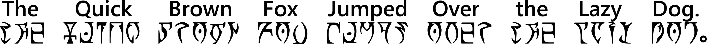

# The Hayghin Daedric Script

This is a simple Daedric character font based upon [Ayembedt](https://github.com/georgd/OpenMW-Fonts) for the letter glyphs, the number system documented by [Llevndryn Sershilavu](https://arador-dayn.fr/viewtopic.php?f=16&t=482) (a.k.a. *Naka*), and some additional punctuation marks from [Source Han Serif](https://github.com/adobe-fonts/source-han-serif) to produce a font that is somewhat comfortable to read and write with.

The word *hayghin* comes from [Casual Dumneris](https://casualscrolls.fandom.com/wiki/Dunmeri_language) and means *simple*, to denote the sparse features of this font. I have admittedly only added glyphs that suit my needs in Markdown.

|  |
|--------------------------------------------------------------|

---

## View on [GitHub.io](https://mmillar-bolis.github.io/HayghinDaedricFont/)

---

## Other Daedric Fonts

- [Daedric Runes](https://www.ffonts.net/Daedric-Runes.font) by Erwin Denissen (*High-Logic*)
- [Oblivion](http://download.fliggerty.com/download-128-515) by Steve Deffeyes (*dongle*)
- [Daedric Runes](https://morroblivion.com/forums/skyrim-general-chat/allis-daedric-runes-opentype-font-kit) by *Alli*
- [Daedra](http://www.pixelsagas.com/?download=daedra) by Neale Davidson (*Pixel Sagas*)
- [Ayembedt](https://github.com/georgd/OpenMW-Fonts) by Georg Duffner
- [Daedric Font Resources](https://www.nexusmods.com/morrowind/mods/45458/) by *Yar-Yulme*
- [Better Daedric Font](https://www.nexusmods.com/morrowind/mods/44540) by *hardek*
- [Daedric Letters Gold](https://www.deviantart.com/yagellonica/art/Daedric-Letters-GOLD-741405288) by *Yagellonica*
- [Shebbz Daedric](https://twitter.com/t00thpasteface/status/1291107593432293376) by *Shebbz*

---

